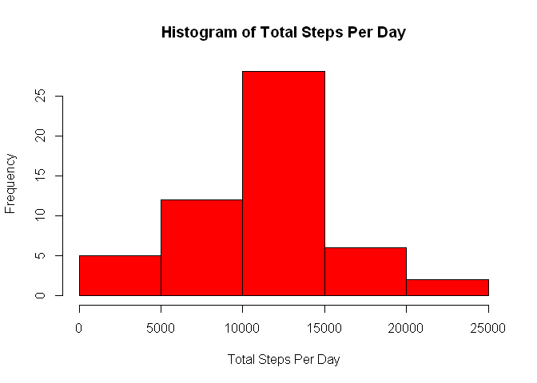
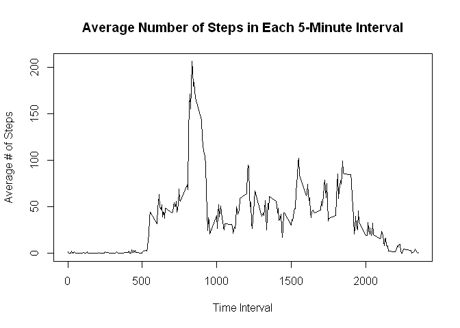
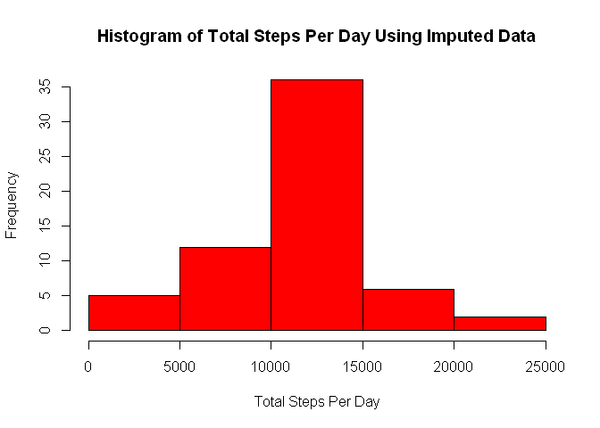
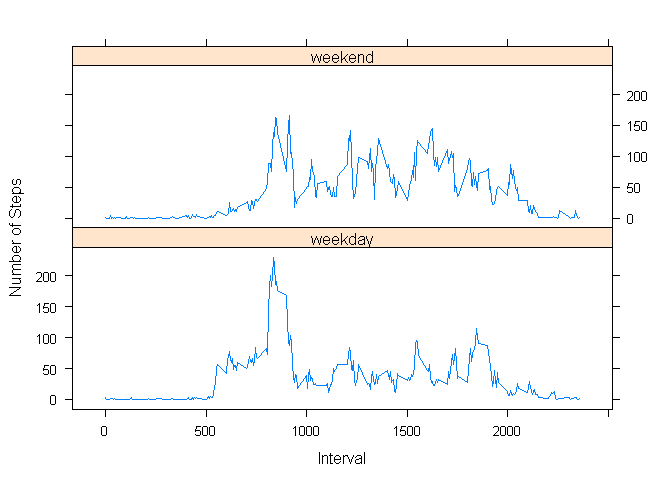

# Reproducible Research: Peer Assessment 1


## Loading and preprocessing the data

The activity.zip file contains a single .csv file called activity.csv. 
First, I read this file into a data frame called activity and I convert the 
date field to a date type.


```r
activity <- read.csv(unz("activity.zip", "activity.csv"))
activity$date <- as.Date(activity$date)
```


## What is mean total number of steps taken per day?

In this step, I calculate the total number of steps per day using the aggregate() function, 
and I plot the result as a histogram.


```r
steps_per_day <- setNames(aggregate(activity$steps ~ activity$date, FUN=sum), c("date","steps"))

hist(steps_per_day$steps, col="red", xlab="Total Steps Per Day", main="Histogram of Total Steps Per Day")
```

 

We can use the mean() and median() functions to calculate the mean and median of the total 
number of steps taken per day, as shown in the output below. 


```r
mean(steps_per_day$steps)
```

```
## [1] 10766.19
```

```r
median(steps_per_day$steps)
```

```
## [1] 10765
```


## What is the average daily activity pattern?

Next we want to look at the average daily activity pattern, by averaging the number of steps 
across all days for each 5-minute interval. I then plot the result using the plot() function. 


```r
steps_per_interval <- setNames(aggregate(activity$steps ~ activity$interval, FUN=mean), 
                               c("interval","average_steps"))

plot(steps_per_interval$interval, steps_per_interval$average_steps, type='l', 
        xlab='Time Interval', ylab='Average # of Steps', 
        main='Average Number of Steps in Each 5-Minute Interval')
```

 

From the preceding plot, we can see that the peak average number of steps per interval is around 200. 
To get the exact value and also determine which interval it occurs in, we can sort the data by descending 
value of average_steps and print the first row. We see that the 5-minute interval beginning at minute 
835 contains the maximum number of steps. 


```r
steps_per_interval[order(steps_per_interval$average_steps, decreasing=TRUE),][1,]
```

```
##     interval average_steps
## 104      835      206.1698
```


## Imputing missing values

In the next part, we want to count the number of missing values in the data set. This value is shown 
in the following output. 


```r
length(which(is.na(activity$steps)))
```

```
## [1] 2304
```

To impute the missing values, I am going to use the mean for each 5-minute interval, which was already calculated 
and saved in steps\_per\_interval. So first I am going to join the activity table with steps\_per\_interval, 
by interval. To use the join() function I must load the plyr package. 


```r
library(plyr)
imputed_steps <- join(activity, steps_per_interval, by='interval', type='left')
```

Now that I have joined the tables together, I can reassign the value of steps to be equal to the value 
of average\_steps, but only for the observations that have a missing value for steps. 


```r
imputed_steps$steps <- ifelse(is.na(imputed_steps$steps), imputed_steps$average_steps, 
                                                          imputed_steps$steps)
```

Finally, I calculate the total number of steps taken each day---this time using the imputed 
data---and I plot the histogram. 


```r
steps_per_day_imputed <- setNames(aggregate(imputed_steps$steps ~ imputed_steps$date, FUN=sum), 
                                  c("date","steps"))

hist(steps_per_day_imputed$steps, col="red", xlab="Total Steps Per Day", 
        main="Histogram of Total Steps Per Day Using Imputed Data")
```

 

Although this histogram has a similar shape to the previous one, we can see that the bin for 10,000-15,000 steps per 
day has increased in frequency, from about 28% to about 35%. The mean values are more heavily weighted by choosing to 
impute the missing values using the mean values. 

Furthermore, we can compute the mean and median number of steps using the imputed data, as shown in the 
following output.


```r
mean(steps_per_day_imputed$steps)
```

```
## [1] 10766.19
```

```r
median(steps_per_day_imputed$steps)
```

```
## [1] 10766.19
```

In this data, the missing values exist for entire days rather than for subsets of the 5-minute intervals within days.
In other words, if I am imputing the values for any part of a day, I am imputing the values for all intervals in that
day. And because I am using the mean number of steps in each 5-minute interval to impute the missing values, I know
that the total number of steps on each imputed day is exactly equal to the mean number of steps per day.

Therefore, because of the way I have chosen to impute missing values, the mean number of steps does not change after
using the imputed values. However, the median does change. Imputing missing values has added eight additional days
where the total number of steps per day is exactly equal to the mean, so the median shifts closer to the mean and in
this case is exactly equal to the mean. 


## Are there differences in activity patterns between weekdays and weekends?

As the last step, we want to look at the activity patterns between weekdays and weekends. First I add a factor variable 
called day\_type to indicate whether each observation corresponds to a weekday or a weekend. Then I aggregate the data 
by both interval and day\_type to calculate the mean number of steps for each interval for each day\_type. 


```r
imputed_steps$day_type <- factor((weekdays(imputed_steps$date)=='Saturday') + 
                                 (weekdays(imputed_steps$date)=='Sunday'))
levels(imputed_steps$day_type) <- c('weekday','weekend')

steps_per_interval_by_day_type <- setNames(aggregate(imputed_steps$steps, 
                                                     list(imputed_steps$interval, 
                                                          imputed_steps$day_type), 
                                                     FUN=mean), 
                                           c("interval","day_type","steps"))
```

Finally, I load the lattice package and use xyplot to display the mean number of steps per interval broken 
down by weekdays and weekends. 


```r
library(lattice)
xyplot(steps ~ interval | day_type, data=steps_per_interval_by_day_type, type='l', 
          layout=c(1,2), xlab='Interval', ylab='Number of Steps')
```

 
